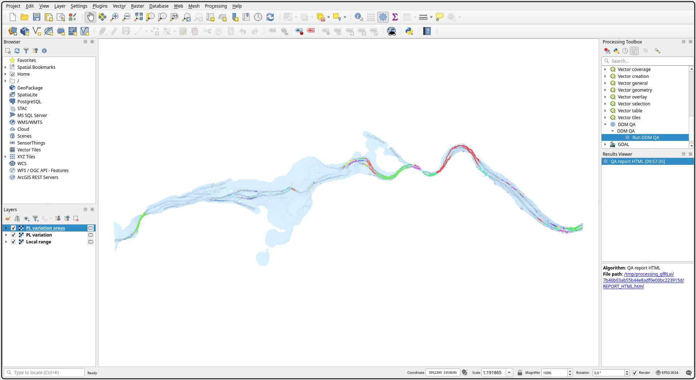
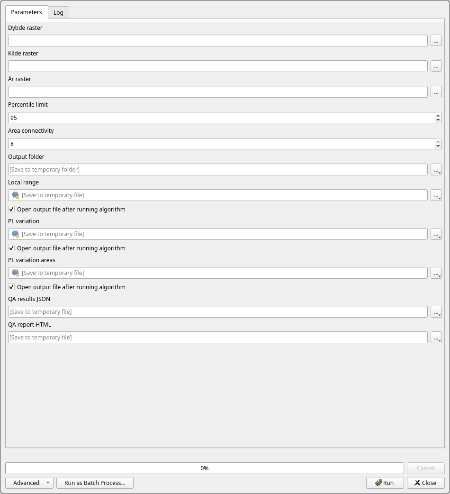
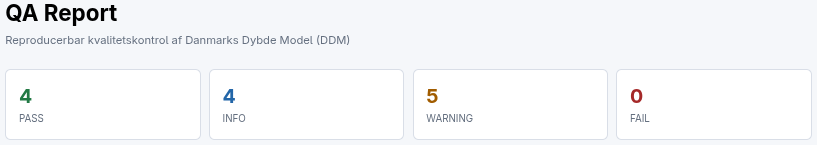
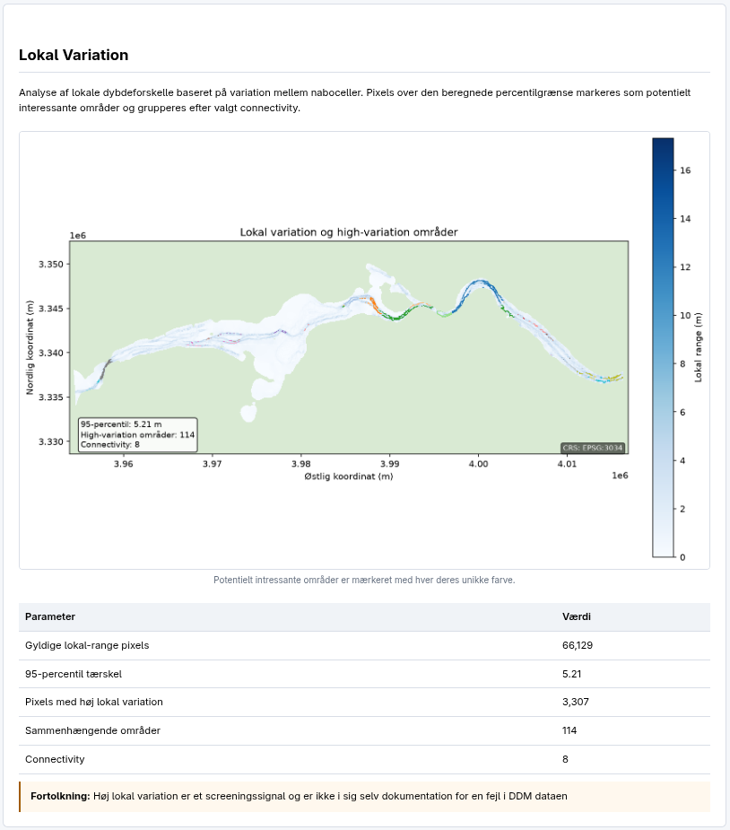
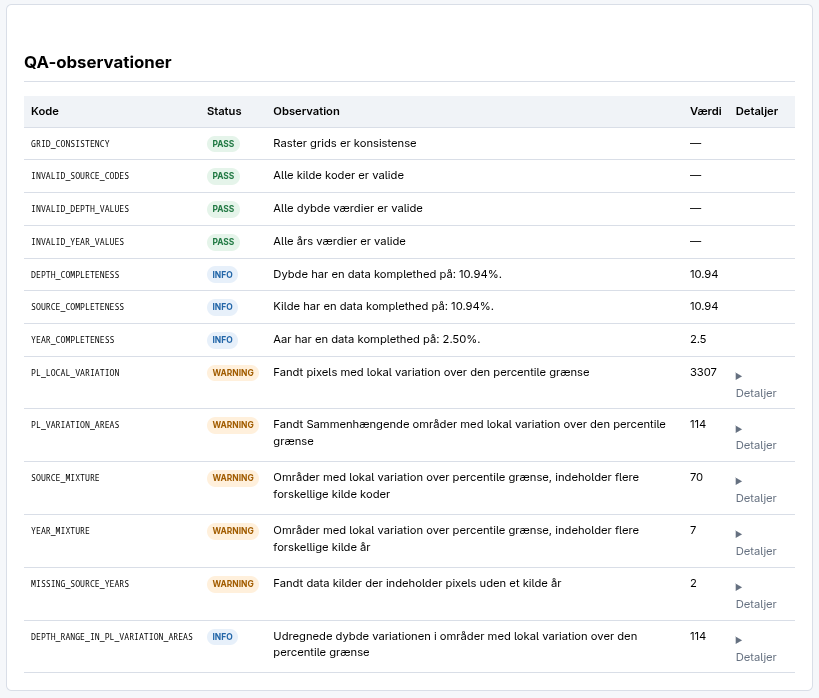
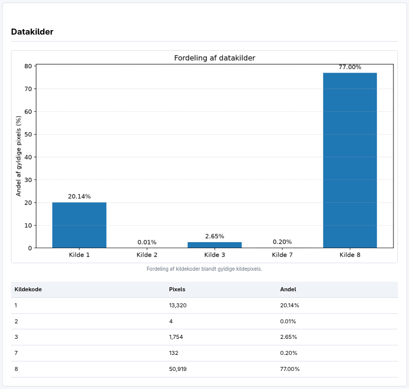
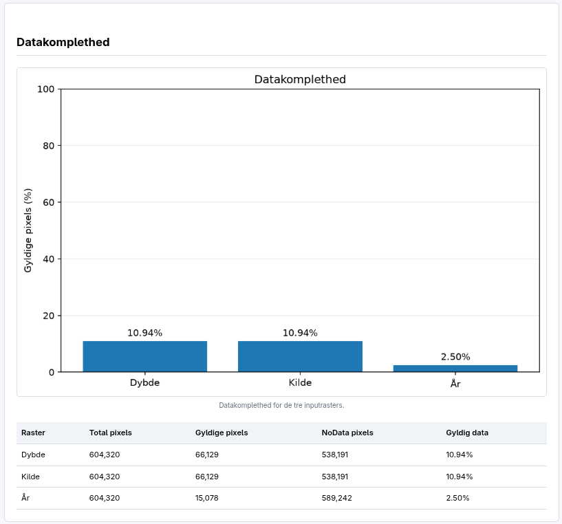
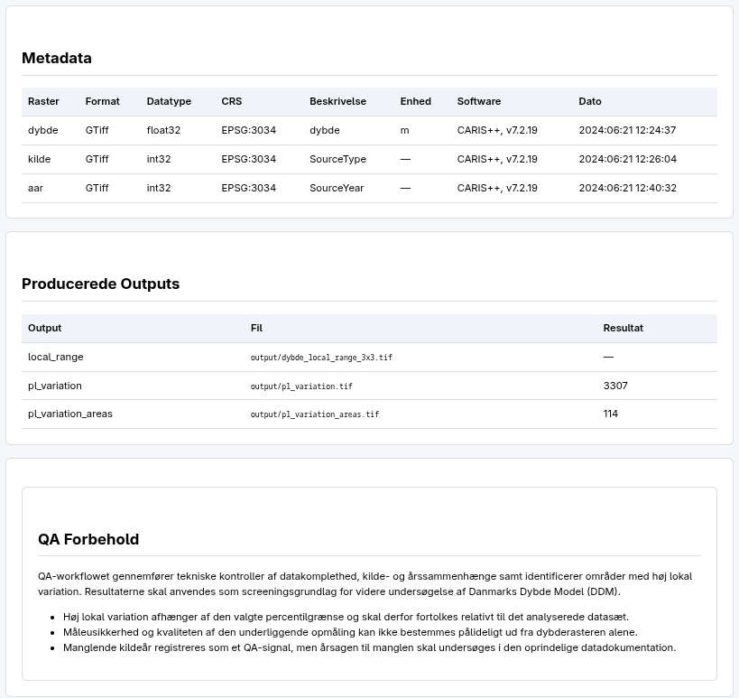

# DDM QA

QGIS plugin til kvalitetskontrol (QA) af **Danmarks Dybdemodel (DDM)**.

Projektet indeholder: QA logik iplementeret i Python, en command line interface (CLI) og et QGIS plugin. Formålet er at automatisere en række kontroller af DDM data og samle resultaterne i både raster output, JSON og en HTML rapport.


---

### Formål med projektet:

DDM QA undersøger:

* om input rasterne har samme: grid, opløsning, CRS og geometri
* om kildekoder er valide
* om dybdeværdier er valide
* om årsværdier er valide
* hvor komplette de enkelte rastere er
* hvordan kilde og år hænger sammen
* hvor der findes høj lokal variation i dybderne
* om områder med høj lokal variation indeholder blandede kilder eller år
* hvilke metadata der findes i inputdata
* hvilke områder der bør undersøges nærmere

---

### Datagrundlag for projektet:

Projektet er udviklet med udgangspunkt i **Danmarks Dybdemodel (DDM)**.

DDM er en digital bathymetrisk model med en opløsning på 50 × 50 meter. Modellen indeholder blandt andet:

* `ddm_50m.dybde`: Dybdeværdier
* `ddm_50m.kilde`: Information om datakilden
* `ddm_50m.aar`: År for afslutning af den relevante opmåling

Data brugt i projektet er hentet fra:

- https://dataforsyningen.dk/data/4817


---

### QA workflow:

Det samlede workflow kan illustreres således:

```text
                        Input: DDM (GeoTIFF)
                                │
                    ┌───────────┼───────────┐
                    │           │           │
                  dybde       kilde        aar
                    │           │           │
                    └───────────┼───────────┘
                                │
                                ▼
                           Valider input
                                │
                                ▼
                          Inspicer input 
                                │
                                ▼
                Udregn lokal variation i dybderasteren 
                                │
                                ▼
                Marker pixels over percentil grænse
                                │
                                ▼
                    Grupper pixels over grænse 
                                │
                                ▼
                    Lav observationer på dataen
                                │
                 ┌──────────────┼──────────────┐
                 │              │              │
                 ▼              ▼              ▼
          Raster outputs   JSON resultat   HTML rapport
                 │
      ┌──────────┴───────────┐
      │                      │
      ▼                      ▼
Lokal variation        Grupperede områder

```

---

### Output:

**Lokal variation Raster:** Et raster med den lokale dybdevariation beregnet ud fra et 3×3 naboskab. gemmes som: 

```text
local_range.tif
```

**Grupperede områder raster:** Et raster med identificerede sammenhængende områder. 

```text
0       = intet område
1..N    = område ID
65535   = NoData
```
Bliver gemt som:
```text
pl_variation_areas.tif
```

**QA resultater:** Alle QA resultater gemmes desuden som JSON:

```text
qa_results.json
```

**HTML report:** En samlet HTML rapport som indeholder både tabeller, observationer, statistik og figurer genereres og gemmes som:

```text
report.html
```

---

### Parametere:

**Percentile limit:** Angiver hvilken percentile der anvendes til at identificere høj lokal variation. 


**Area connectivity:** Bestemmer hvordan nabopixels forbindes til områder.

```text
4 = kun vandrette/lodrette naboer
8 = også diagonale naboer
```

---

### CLI

QA logikken kan køres uden QGIS gennem:

```text
ddm_qa_cli.py
```

Eksempel:

```bash
python ddm_qa_cli.py \
    --dybde /path/to/ddm_50m.dybde.tif \
    --kilde /path/to/ddm_50m.kilde.tif \
    --aar /path/to/ddm_50m.aar.tif \
    --local-range /path/to/local_range.tif \
    --pl-variation /path/to/pl_variation.tif \
    --pl-variation-areas /path/to/pl_variation_areas.tif \
    --percentile-limit 95 \
    --pl-area-connect 8 \
    --result-json /path/to/qa_results.json \
    --report-html /path/to/report.html
```

CLI'en fungerer som et separat interface til `ddm_qa()` og gør det muligt at køre QA processen uden QGIS.

---

## QGIS Processing

Når pluginet er installeret, findes algoritmen under QGIS Processing:

```text
DDM QA
└── Run DDM QA
```

Pluginet starter QA logikken som en separat proces og viser output fra processen i QGIS Processing loggen.

Efter afsluttet QA indlæses output rasterne automatisk i QGIS og får passende visualisering:

* **Local range:** Kontinuerlig color ramp
* **PL variation areas:** forskellige farver for de enkelte områder

---

### Eksempeler:

#### Output i QGIS:



#### Plugin popup vindue i QGIS:



#### QA-rapport:







